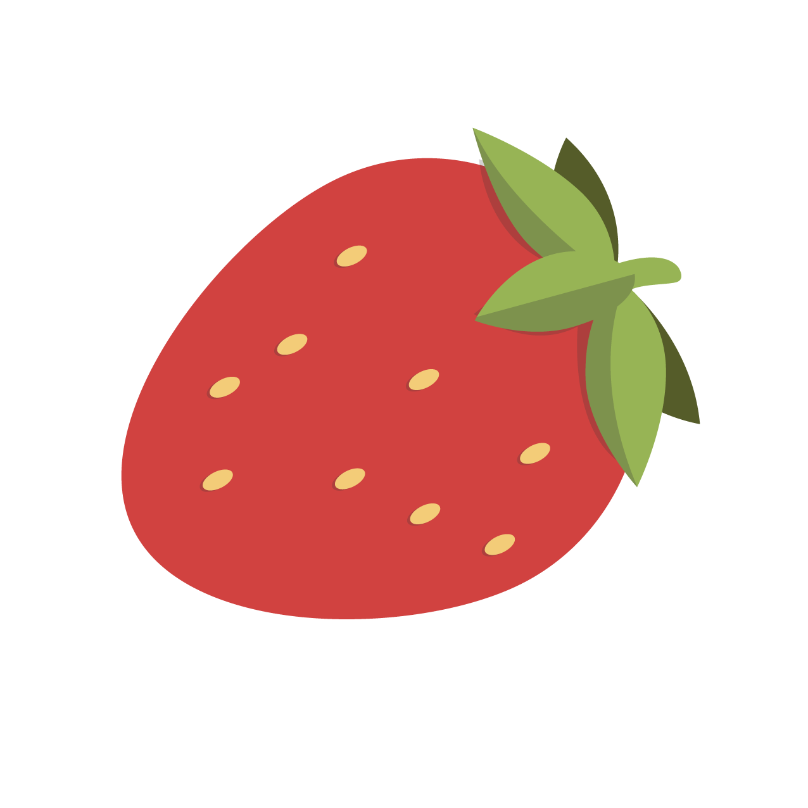
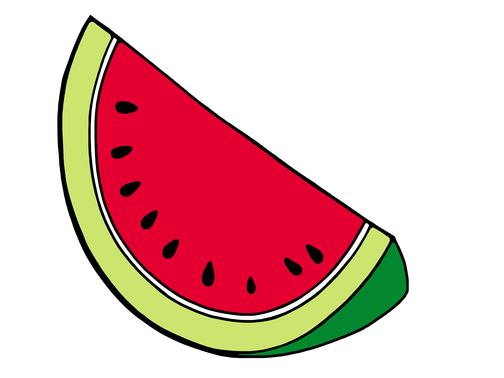

The README.md is generated by ChatGPT

# 🐍 Snake Game with Pygame

A simple and nostalgic Snake Game built with Python and Pygame — now featuring strawberries 🍓, watermelons 🍉, and a colorful grid!

## 📸 Sneak Peek

| Player (You) | Snake Body | Food |
|--------------|-------------|------|
|  |  |   |


> *Only strawberry is currently used in the game logic. Watermelon is included for future expansion or customization 🍉✨

## 🚀 Features

- Playable 15x15 grid Snake game
- Snake grows when eating food
- Collision detection with walls & body (game over logic)
- Restart functionality with `R` key
- Colorful sprite-based design

## 🎮 Controls

| Key | Action |
|-----|--------|
| `W` | Move Up |
| `A` | Move Left |
| `S` | Move Down |
| `D` | Move Right |
| `Q` | Quit Game |
| `R` | Restart After Game Over |

## 📂 File Structure

```
.
├── main.py               # Main game logic
├── template.py           # Basic Pygame window template
├── Sprites/
│   ├── greensquare.png   # Player's head
│   ├── bluesquare.png    # Snake body
│   ├── strawberry.png    # Food
│   └── watermelon.png    # Unused (for now)
```

## 🛠️ Requirements

- Python 3.x
- `pygame` library

```bash
pip install pygame
```

## ▶️ How to Run

```bash
python main.py
```

## 🧠 Credits & Notes

- Made for fun and learning purposes
- You can expand the game by adding more food types, increasing speed, or adding sound effects!
- Special thanks to nostalgia and childhood computer labs for the original inspiration 🐍❤️
